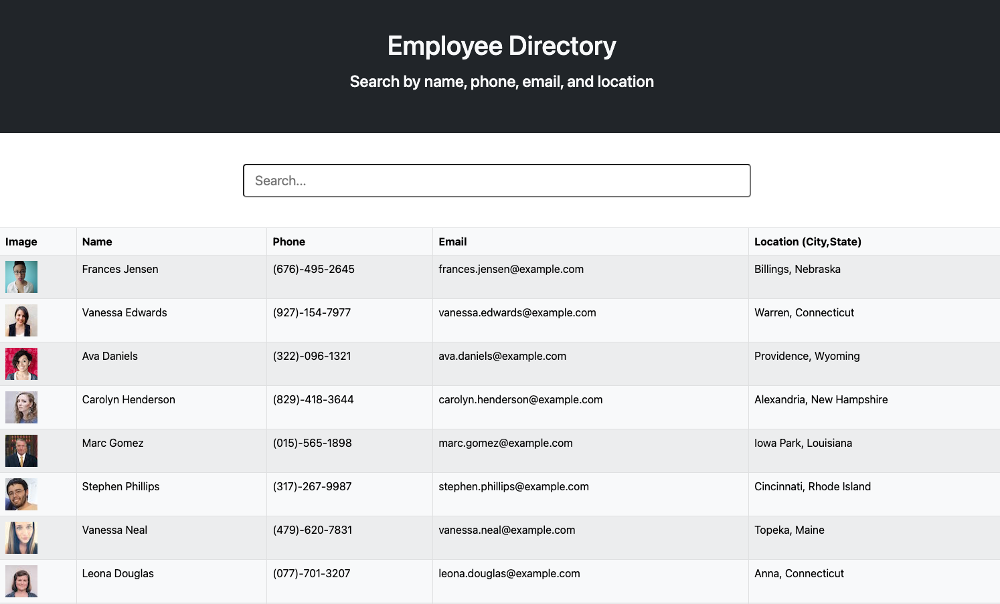

# Employee Directory

Github Repository: https://github.com/Cynwise/employeeDirectory

Deployment Link: https://apple-martini-679.herokuapp.com/

## Description

This is an employee directory application made using React. The project uses the randomuser.me api to pull a number of generated employees. The application updates dynamically as you enter search terms into the search bar. The user can search by employee name, phone, email, or location.

## Built With

* [node.js](https://nodejs.org/en/)

* [react](https://reactjs.org/)

* [bootstrap](https://getbootstrap.com/)

* [javascript](https://developer.mozilla.org/en-US/docs/Web/javascript)

* [randomuser.me](https://randomuser.me/)

## Contributers

William Farnsworth - [Github](https://github.com/Cynwise)
